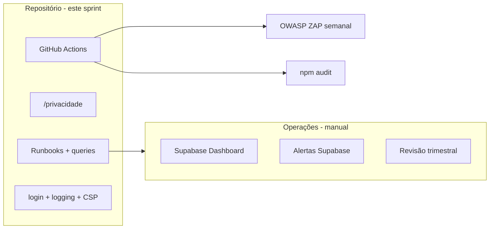

# Fase 3 + Segurança Contínua — Ferreira na Voz

## Contexto

Fases 1–2 estão implementadas no código ([`docs/SECURITY.md`](docs/SECURITY.md), [`docs/SECURITY_PHASE2_REPORT.md`](docs/SECURITY_PHASE2_REPORT.md)). A Fase 3 e os adicionais ainda estão 100% abertos no repositório.



---

## 1. Auditoria de dependências

**Criar** [`.github/dependabot.yml`](.github/dependabot.yml):

- Updates semanais para `npm` (`package.json` / lockfile)
- Agrupar patches/minor quando possível

**Criar** [`.github/workflows/security.yml`](.github/workflows/security.yml):

- Job `npm audit` em push/PR (`npm audit --audit-level=high`; falha em high/critical)
- Job `test:security` existente (`npm run test:security`)
- Job ZAP semanal (cron `0 6 * * 1` — segunda 06:00 UTC) contra `https://ferreiraservice.vercel.app` (URL já referenciada em [`docs/TWITCH_SETUP.md`](docs/TWITCH_SETUP.md))
- ZAP: `zaproxy/action-baseline@v0.12.0`, `rules_file_name: '.zap/rules.tsv'`, `cmd_options: '-a'` (spider leve)
- Artefatos de relatório HTML anexados ao workflow (não bloquear deploy na primeira semana — `continue-on-error: true` com comentário no SECURITY.md para endurecer depois)

**Adicionar** script em [`package.json`](package.json): `"audit:ci": "npm audit --audit-level=high"`

---

## 2. Monitoramento de spam / abuso

Sem acesso ao projeto Supabase em runtime, entregamos **queries + runbook** em novo arquivo [`docs/MONITORING.md`](docs/MONITORING.md):

| Métrica            | Query / fonte                                                                     |
| ------------------ | --------------------------------------------------------------------------------- |
| Inserts homepage   | `count(*) from pedidos_cliente where created_at > now() - interval '1 hour'`      |
| Rate limit hits    | `count(*) from homepage_rate_events where created_at > now() - interval '1 hour'` |
| Picos por WhatsApp | `whatsapp_hash, count(*) ... group by 1 having count(*) > 5`                      |

**Incluir** no doc:

- Thresholds sugeridos (ex.: >20 pedidos/h global → investigar)
- Passos no Supabase Dashboard (Logs → API, Database → query scheduler opcional)
- Referência às funções já existentes em [`supabase/setup.sql`](supabase/setup.sql): `prune_homepage_rate_events()`, `purge_expired_pedidos_cliente()` — com snippet pg_cron comentado para ativar em produção

**Opcional leve no SQL** (nova migration `security_phase3_monitoring.sql`):

- View `admin_monitoring_homepage_stats` (security invoker, `grant select` só para `authenticated` + policy `is_admin()`) — facilita painel futuro sem expor `homepage_rate_events` via API anon

---

## 3. Política de privacidade + LGPD

**Criar** rota [`src/routes/privacidade.tsx`](src/routes/privacidade.tsx) com rascunho baseado no comportamento real do app:

- **Dados coletados:** nome/personagem, WhatsApp, Discord (opcional), slots de agenda, status de pedido
- **Finalidade:** contratação de serviço, comunicação operacional, gestão de fila no painel admin
- **Base legal:** execução de contrato / legítimo interesse (serviço solicitado pelo titular)
- **Retenção:** contratos Finalizado/Arquivado removidos após 5 dias ([`src/lib/clients/retention.ts`](src/lib/clients/retention.ts), `purge_expired_pedidos_cliente()`)
- **Compartilhamento:** Supabase (processador), Twitch embed (sem envio de dados pessoais do formulário)
- **Direitos do titular:** contato via WhatsApp do site; exclusão mediante solicitação
- **Cookies/sessão:** apenas sessão admin (Supabase Auth) no painel
- **Controlador:** Lucas F F da Silva — contato alinhado ao WhatsApp público do site
- Aviso: _"Rascunho operacional — revisão jurídica recomendada"_

**Atualizar** [`src/components/landing/Footer.tsx`](src/components/landing/Footer.tsx): link "Política de Privacidade" → `/privacidade`; substituir tagline genérica por referência à política

---

## 4. Revisão trimestral de policies

**Criar** [`docs/SECURITY_QUARTERLY_REVIEW.md`](docs/SECURITY_QUARTERLY_REVIEW.md) — checklist datada (template com seções):

- [ ] Releitura de todas as policies em [`supabase/migrations/security_phase1_rls.sql`](supabase/migrations/security_phase1_rls.sql) e [`security_phase2_hardening.sql`](supabase/migrations/security_phase2_hardening.sql)
- [ ] Confirmar que [`fix_pedidos_rls_public.sql`](supabase/migrations/fix_pedidos_rls_public.sql) **nunca** foi aplicado em produção
- [ ] Validar `admin_allowlist` (e-mails atuais)
- [ ] Revisar novas migrations desde última revisão
- [ ] Rodar smoke tests Fase 1 (seção em SECURITY.md)
- [ ] Resultado do último ZAP + `npm audit`
- [ ] Registrar data e responsável

**Atualizar** [`docs/SECURITY.md`](docs/SECURITY.md) Fase 3 com links para os novos docs e marcar itens conforme implementados.

---

## 5. OWASP ZAP baseline (semanal)

Conforme escolha: GitHub Action agendada (item 1). **Criar** [`.zap/rules.tsv`](.zap/rules.tsv) para ignorar falsos positivos conhecidos (ex.: headers só na Vercel edge, não no ZAP local).

Documentar em [`docs/SECURITY.md`](docs/SECURITY.md) como interpretar relatórios e quando escalar.

---

## 6. Plano de incidente

**Criar** [`docs/INCIDENT_RESPONSE.md`](docs/INCIDENT_RESPONSE.md):

1. **Detecção** — picos em `homepage_rate_events`, ZAP crítico, alerta Supabase
2. **Contenção imediata**
   - `revoke execute on create_pedido_homepage from anon` (SQL snippet)
   - Rotacionar anon key no Dashboard
   - Desabilitar sign-up se comprometido
3. **Investigação** — logs Supabase, `homepage_rate_events`, Vercel logs
4. **Recuperação** — re-grant RPC, validar RLS, smoke tests
5. **Comunicação** — template de mensagem ao titular se vazamento de WhatsApp/Discord
6. **Pós-incidente** — entrada no SECURITY_QUARTERLY_REVIEW

---

## 7. Itens adicionais (código)

### 7a. Admin check no redirect do login

Em [`src/routes/login.tsx`](src/routes/login.tsx), no `useEffect` de sessão existente:

```ts
// Hoje: session → navigate(/dispatch) sem checar admin
// Novo: session → isCurrentUserAdmin() → navigate ou signOut + mensagem
```

Reutilizar [`isCurrentUserAdmin`](src/lib/auth.ts) já usado em `requireAdmin` / `ProtectedRoute`. Mensagem amigável: _"Esta conta não tem acesso ao painel."_

### 7b. CSP — third party `decapi.me`

[`use-twitch-status.ts`](src/hooks/use-twitch-status.ts) chama `https://decapi.me/twitch/uptime/...` — **ausente** no CSP em [`vercel.json`](vercel.json).

Adicionar `https://decapi.me` em `connect-src` do `Content-Security-Policy-Report-Only` (prepara enforce futuro).

### 7c. Logging sem PII

**Criar** [`src/lib/safe-log.ts`](src/lib/safe-log.ts):

- `safeError(context, error)` — loga só `message`, `code`, `name`; nunca objeto `Error` completo nem payloads de pedido
- Lista de chaves redacted: `password`, `token`, `whatsapp`, `discord`, `nome`, `authorization`

**Aplicar** em pontos de maior risco:

- [`src/routes/__root.tsx`](src/routes/__root.tsx) — `console.error(error)` → `safeError`
- [`src/server.ts`](src/server.ts) / [`src/start.ts`](src/start.ts) — SSR errors

Demais `console.warn` já usam `error.message` — documentar regra em [`docs/MONITORING.md`](docs/MONITORING.md) ou seção em SECURITY.md.

### 7d. Secrets — verificação

- Confirmar ausência de `service_role` / `TWITCH_CLIENT_SECRET` em `VITE_*` (já OK em [`.env.example`](.env.example))
- Adicionar checklist em SECURITY.md: _"grep VITE\_ no repo; rotacionar se exposto"_
- Não mover PIX neste sprint (opcional, baixo risco — telefone público)

### 7e. Realtime + JWT admin

Sem mudança de código — RLS já restringe `pedidos_cliente` e `dispatch_queue`. Documentar em MONITORING.md que canais sensíveis exigem JWT admin e que `reservas_semana` / `disponibilidade_agenda` são leitura pública intencional.

### 7f. Supabase Auth hardening (manual)

Expandir seção em [`docs/SECURITY.md`](docs/SECURITY.md) com checklist Dashboard:

- Leaked password protection
- Rate limit / captcha no login
- E-mail confirmado em troca de senha
- MFA TOTP no admin (item Fase 2 ainda aberto)

---

## 8. Atualização do checklist principal

Ao concluir, marcar em [`docs/SECURITY.md`](docs/SECURITY.md):

| Item Fase 3            | Entregável                               |
| ---------------------- | ---------------------------------------- |
| npm audit / Dependabot | `.github/*`                              |
| Monitorar inserts      | `docs/MONITORING.md` + view SQL opcional |
| LGPD                   | `/privacidade` + footer                  |
| Revisão trimestral     | `SECURITY_QUARTERLY_REVIEW.md`           |
| OWASP ZAP              | workflow semanal                         |
| Plano de incidente     | `INCIDENT_RESPONSE.md`                   |

---

## Ordem de implementação sugerida

1. Docs de operação (INCIDENT_RESPONSE, MONITORING, QUARTERLY_REVIEW)
2. CI (Dependabot + security.yml + ZAP)
3. Rota `/privacidade` + footer
4. Fixes de código (login admin, safe-log, CSP decapi.me)
5. Migration monitoring view (se aprovada)
6. Atualizar SECURITY.md com links e checkboxes

## Fora de escopo neste sprint

- CSP **enforce** (permanece report-only — item "Melhorias futuras")
- PIX via server fn (opcional Fase 2)
- Configuração real de alertas no Supabase Dashboard (documentado, execução manual)
- MFA / leaked passwords no Dashboard (manual)

## Testes

- `npm run test:security` (redirect)
- `npm run audit:ci` local
- Navegar `/privacidade` e footer
- Login com sessão não-admin → não redireciona para `/dispatch`
- Disparar workflow security manualmente (`workflow_dispatch`) para validar ZAP
