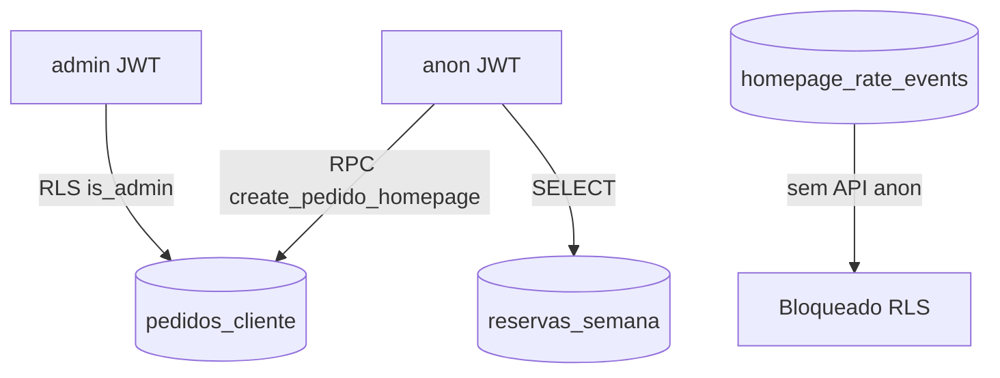

# Monitoramento e observabilidade — Ferreira na Voz

Guia para detectar spam, abuso na homepage e anomalias operacionais. Complementa rate limits em [`security_phase2_hardening.sql`](../supabase/migrations/security_phase2_hardening.sql) e [`INCIDENT_RESPONSE.md`](INCIDENT_RESPONSE.md).

---

## Arquitetura de dados sensíveis



### Realtime (Supabase)

| Tabela                                      | Quem assina                  | RLS                                     |
| ------------------------------------------- | ---------------------------- | --------------------------------------- |
| `pedidos_cliente`                           | Painel admin                 | Só `is_admin()` — JWT admin obrigatório |
| `dispatch_queue`                            | Painel (se backend supabase) | Admin only (Fase 2)                     |
| `live_service_session`                      | Landing telemetria           | Leitura pública; escrita admin          |
| `reservas_semana`, `disponibilidade_agenda` | Landing agenda               | SELECT público intencional (grade)      |

Canais sensíveis (`pedidos_cliente`, `dispatch_queue`) exigem sessão admin; anon não recebe eventos de pedidos mesmo com subscription.

---

## Queries de monitoramento (SQL Editor)

Executar com role **service_role** ou conexão direta Postgres (não expor ao client).

### Pedidos homepage — última hora

```sql
select count(*) as pedidos_ultima_hora
from pedidos_cliente
where origem = 'homepage'
  and created_at > now() - interval '1 hour';
```

### Série temporal (24h)

```sql
select date_trunc('hour', created_at) as hora, count(*) as total
from pedidos_cliente
where origem = 'homepage'
  and created_at > now() - interval '24 hours'
group by 1
order by 1 desc;
```

### Eventos de rate limit — última hora

```sql
select count(*) as rate_events_ultima_hora
from homepage_rate_events
where created_at > now() - interval '1 hour';
```

### Picos por WhatsApp (hash)

```sql
select whatsapp_hash, count(*) as tentativas
from homepage_rate_events
where created_at > now() - interval '1 hour'
group by 1
having count(*) > 5
order by 2 desc;
```

### View agregada (após migration Fase 3)

Se [`security_phase3_monitoring.sql`](../supabase/migrations/security_phase3_monitoring.sql) estiver aplicada:

```sql
select * from admin_monitoring_homepage_stats;
```

(Acesso só para JWT admin via RLS na view.)

---

## Thresholds sugeridos

| Métrica                            | Normal     | Investigar | Ação                                                  |
| ---------------------------------- | ---------- | ---------- | ----------------------------------------------------- |
| Pedidos homepage / hora            | 0–5        | >20        | Ver [`INCIDENT_RESPONSE.md`](INCIDENT_RESPONSE.md) §2 |
| `homepage_rate_events` / hora      | 0–15       | >50        | Possível bot; revisar Turnstile                       |
| Mesmo `whatsapp_hash` / hora       | ≤3         | >5         | Rate limit pode estar falhando                        |
| Erros `rate_limit_global` nos logs | esporádico | contínuo   | Considerar revoke RPC temporário                      |

---

## Supabase Dashboard

1. **Logs → API** — filtrar `create_pedido_homepage`, `rate_limit`
2. **Logs → Postgres** — erros de policy / RLS
3. **Database → Extensions** — habilitar `pg_cron` se quiser jobs automáticos (ver abaixo)
4. **Reports** — uso de API e conexões (picos inesperados)

### Alertas (manual)

Supabase não envia alertas customizados em todos os planos. Alternativas:

- Query agendada + webhook (Edge Function ou cron externo)
- Revisão semanal das queries acima
- GitHub Action ZAP semanal (já em [`.github/workflows/security.yml`](../.github/workflows/security.yml))

---

## Manutenção agendada (pg_cron)

Funções já existentes em [`setup.sql`](../supabase/setup.sql):

```sql
-- Habilitar extensão (uma vez)
create extension if not exists pg_cron;

-- Podar eventos de rate limit (>7 dias) — diário 03:00 UTC
select cron.schedule(
  'prune-homepage-rate-events',
  '0 3 * * *',
  $$ select public.prune_homepage_rate_events(); $$
);

-- Apagar pedidos Finalizado/Arquivado >5 dias — diário 04:00 UTC
select cron.schedule(
  'purge-expired-pedidos',
  '0 4 * * *',
  $$ select public.purge_expired_pedidos_cliente(); $$
);
```

`prune_homepage_rate_events()` definida em [`security_phase2_hardening.sql`](../supabase/migrations/security_phase2_hardening.sql).

---

## Logging na aplicação (sem PII)

**Nunca logar em produção:**

- Senhas ou tokens completos (`authorization`, `access_token`)
- WhatsApp, Discord, nome de cliente
- Payload completo de pedidos

**Padrão aprovado:** `console.warn("[context]", error.message)` ou [`safeError`](../src/lib/safe-log.ts).

**Evitar:** `console.error(error)` com objeto `Error` completo em boundaries SSR — pode incluir input do usuário no stack.

Contextos existentes: `[auth]`, `[clients]`, `[agenda]`, `[dispatch]`.

---

## Vercel

- **Runtime Logs** — erros SSR (`[server]`, h3 swallowed errors)
- **Analytics** (se habilitado) — picos de tráfego na landing
- Headers de segurança aplicados em [`vercel.json`](../vercel.json) (CSP report-only)

---

## Checklist semanal (5 min)

- [ ] Query pedidos última hora dentro do normal
- [ ] `homepage_rate_events` sem pico anormal
- [ ] Último workflow Security (audit + ZAP) sem regressão crítica
- [ ] Nenhum alerta de secret no repositório

Registrar achados na próxima [`SECURITY_QUARTERLY_REVIEW.md`](SECURITY_QUARTERLY_REVIEW.md).
