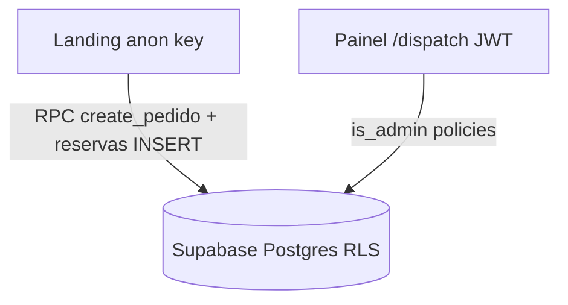

# Segurança — Ferreira na Voz

Checklist de implementação por fases. Marque `- [x]` conforme concluir.

**Arquitetura**



Referências: [`supabase/setup.sql`](../supabase/setup.sql), [`supabase/migrations/security_phase1_rls.sql`](../supabase/migrations/security_phase1_rls.sql), [`.env.example`](../.env.example).

---

## Fase 1 — Crítico (RLS + admin + homepage)

### Código (repositório)

- [x] Migration `security_phase1_rls.sql` (allowlist, `is_admin()`, `claim_token`, RPCs, policies)
- [x] `setup.sql` alinhado com as mesmas regras
- [x] Fluxo homepage: `create_pedido_homepage` + `rollback_pedido_homepage` + `claimToken` no client

### Manual — Supabase Dashboard

- [ ] **Authentication → Providers → Email**: desabilitar registro público (sign-up). Criar usuários admin manualmente ou por convite.
- [ ] **SQL Editor**: executar [`supabase/migrations/security_phase1_rls.sql`](../supabase/migrations/security_phase1_rls.sql) no projeto de produção.
- [ ] **SQL Editor**: executar [`supabase/migrations/security_phase1_fix_reservas_insert.sql`](../supabase/migrations/security_phase1_fix_reservas_insert.sql) (corrige insert em `reservas_semana` após Fase 1).
- [ ] **SQL Editor**: executar [`supabase/migrations/security_phase1_fix_rollback_and_rate.sql`](../supabase/migrations/security_phase1_fix_rollback_and_rate.sql) (corrige griefing no rollback + bloqueia RPC direta de rate limit).
- [ ] **Admin allowlist**: inserir o e-mail do operador (veja seção abaixo).
- [ ] Confirmar que a conta de login do painel usa exatamente o mesmo e-mail cadastrado na allowlist.

### Inserir e-mail do operador

O e-mail do operador já está no seed da migration (`hoennkeys@gmail.com`). Se o projeto foi migrado **antes** desse seed, execute no SQL Editor:

```sql
insert into public.admin_allowlist (email)
values ('hoennkeys@gmail.com')
on conflict (email) do nothing;
```

### Testes — role anon (homepage)

Execute no SQL Editor com contexto anon ou via API com anon key:

- [ ] `select * from pedidos_cliente` → **deve falhar** (0 rows ou permission denied).
- [ ] Na landing: abrir modal de contratação, preencher e confirmar slot → pedido criado e WhatsApp abre.
- [ ] Simular slot ocupado: após criar pedido, se reserva falhar, pedido não deve permanecer (rollback com `claim_token`).

### Testes — admin autenticado (painel)

Com sessão do operador em `/dispatch`:

- [ ] Listagem de pedidos carrega (Realtime + SELECT admin).
- [ ] Aprovar pedido pendente → status Ativo + fila dispatch.
- [ ] Arquivar / finalizar / remover fechados funciona.
- [ ] Agenda admin: bloquear/desbloquear slot.
- [ ] `repairOrphanReservas` no painel não gera erro de permissão em `pedidos_cliente`.

---

## Fase 2 — Importante

### Headers HTTP (Vercel)

- [x] Adicionar em `vercel.json`: `Strict-Transport-Security`, `X-Content-Type-Options`, `X-Frame-Options`, `Referrer-Policy`, `Permissions-Policy`.
- [x] Content-Security-Policy em **report-only** (ajustar domínios antes de enforce).

### Aplicação

- [x] Rate limit + Turnstile (opcional) + honeypot no [`OnboardingModal`](../src/components/landing/OnboardingModal.tsx).
- [x] Validar `redirect` no login — [`safe-redirect.ts`](../src/lib/safe-redirect.ts) + testes `npm run test:security`.
- [x] Proteger server functions (rate limit, cache Twitch, CSRF em [`start.ts`](../src/start.ts)).
- [x] Painel `/dispatch`: [`requireAdmin`](../src/lib/auth.ts) + `check_is_admin` RPC.
- [x] Login: checagem admin antes de redirecionar sessão existente — [`login.tsx`](../src/routes/login.tsx).
- [ ] **Manual:** MFA na conta admin (Supabase → Authentication → Users → enable MFA).

### SQL — executar em produção

- [ ] [`security_phase2_hardening.sql`](../supabase/migrations/security_phase2_hardening.sql) — rate limit na RPC `create_pedido_homepage`, RLS `live_service_session` / `dispatch_queue`, `check_is_admin`.

### Dados / secrets

- [ ] Revisar se chave PIX no client pode ir para config server (opcional).
- [ ] Confirmar `.env` fora do git; rotacionar keys se já vazaram.
- [ ] **Opcional:** Turnstile (`VITE_TURNSTILE_SITE_KEY` + `TURNSTILE_SECRET_KEY`) — reforço anti-bot; sem keys, rate limit + honeypot + limite no DB continuam ativos.

Relatório detalhado: [`SECURITY_PHASE2_REPORT.md`](SECURITY_PHASE2_REPORT.md).

---

## Fase 3 — Contínuo

### Código (repositório)

- [x] `npm audit` / Dependabot — [`.github/dependabot.yml`](../.github/dependabot.yml), [`.github/workflows/security.yml`](../.github/workflows/security.yml), script `npm run audit:ci`
- [x] Monitoramento documentado — [`MONITORING.md`](MONITORING.md); view/RPC [`security_phase3_monitoring.sql`](../supabase/migrations/security_phase3_monitoring.sql)
- [x] Política de privacidade LGPD — rota [`/privacidade`](../src/routes/privacidade.tsx), link no [`Footer`](../src/components/landing/Footer.tsx)
- [x] Revisão trimestral — template [`SECURITY_QUARTERLY_REVIEW.md`](SECURITY_QUARTERLY_REVIEW.md)
- [x] OWASP ZAP baseline semanal — workflow `security.yml` (segunda 06:00 UTC) contra produção; regras em [`.zap/rules.tsv`](../.zap/rules.tsv)
- [x] Plano de incidente — [`INCIDENT_RESPONSE.md`](INCIDENT_RESPONSE.md)

### Manual — produção / operação

- [ ] Executar [`security_phase3_monitoring.sql`](../supabase/migrations/security_phase3_monitoring.sql) no SQL Editor
- [ ] Configurar pg_cron para `prune_homepage_rate_events` e `purge_expired_pedidos_cliente` (ver [`MONITORING.md`](MONITORING.md))
- [ ] Primeira revisão trimestral preenchida em [`SECURITY_QUARTERLY_REVIEW.md`](SECURITY_QUARTERLY_REVIEW.md)
- [ ] Revisar relatório ZAP semanal (GitHub Actions → artefato `zap-report`); endurecer workflow quando estável (remover `continue-on-error`)

### Adicionais (Fase 3)

- [x] Admin check no login — [`login.tsx`](../src/routes/login.tsx) + `signOutAndClearSession()` anti-loop
- [x] CSP `decapi.me` em `connect-src` — [`vercel.json`](../vercel.json) (Twitch uptime em [`use-twitch-status.ts`](../src/hooks/use-twitch-status.ts))
- [x] Logging sem PII — [`safe-log.ts`](../src/lib/safe-log.ts) em SSR/error boundaries
- [ ] **Manual:** Supabase Auth hardening no Dashboard (ver seção abaixo)

### Verificação de secrets

Confirmar que segredos **nunca** usam prefixo `VITE_`:

```bash
rg "VITE_.*SECRET|VITE_.*SERVICE_ROLE|service_role" --glob "!node_modules"
```

Esperado: apenas `VITE_SUPABASE_URL`, `VITE_SUPABASE_ANON_KEY` (públicos por design), `VITE_TURNSTILE_SITE_KEY` (site key pública). `TWITCH_CLIENT_SECRET`, `TURNSTILE_SECRET_KEY` e `service_role` ficam só no servidor/Vercel.

- [ ] Rodar grep acima; rotacionar chaves se algo sensível aparecer no histórico git

### Supabase Auth hardening (Dashboard — manual)

- [ ] **Leaked password protection** — Authentication → Settings
- [ ] **Rate limit / captcha no login** — anti brute-force em `/login`
- [ ] **E-mails de alteração de senha** — exigir confirmação por e-mail
- [ ] **MFA TOTP** na conta admin (também item Fase 2)

### OWASP ZAP — interpretação

- **High/Critical novos:** investigar em [`INCIDENT_RESPONSE.md`](INCIDENT_RESPONSE.md); ajustar [`.zap/rules.tsv`](../.zap/rules.tsv) só para falsos positivos confirmados
- **Medium:** priorizar na revisão trimestral
- CSP report-only ainda não bloqueia — violações aparecem no console do browser, não no ZAP

### Logging (produção)

Não logar senhas, tokens completos, WhatsApp, Discord nem payloads de pedidos. Usar [`safeError`](../src/lib/safe-log.ts) ou `error.message` com prefixo de contexto. Detalhes em [`MONITORING.md`](MONITORING.md).

Relatório Fase 3 + refinamentos: [`SECURITY_PHASE3_REFINEMENTS_REPORT.md`](SECURITY_PHASE3_REFINEMENTS_REPORT.md).

---

## Melhorias futuras (fora das fases acima)

- [ ] RPC transacional único: criar pedido + reservas em uma transação.
- [ ] Edge Function com rate limit por IP (reforço além do limite por WhatsApp no Postgres).
- [ ] CSP **enforce** (hoje report-only em `vercel.json`).

---

## Estado atual da Fase 1

| Recurso                               | Anon                               | Admin (`is_admin`) |
| ------------------------------------- | ---------------------------------- | ------------------ |
| `pedidos_cliente` SELECT              | Negado                             | Permitido          |
| `pedidos_cliente` INSERT direto       | Negado                             | —                  |
| `pedidos_cliente` via RPC homepage    | `create_pedido_homepage`           | —                  |
| `pedidos_cliente` rollback homepage   | `rollback_pedido_homepage` + token | —                  |
| `reservas_semana` SELECT              | Permitido (grade)                  | Permitido          |
| `reservas_semana` INSERT              | Só pedido Pendente homepage        | —                  |
| `reservas_semana` DELETE              | Negado (RPC rollback)              | Permitido          |
| `disponibilidade_agenda` UPDATE admin | Negado                             | `is_admin()`       |
