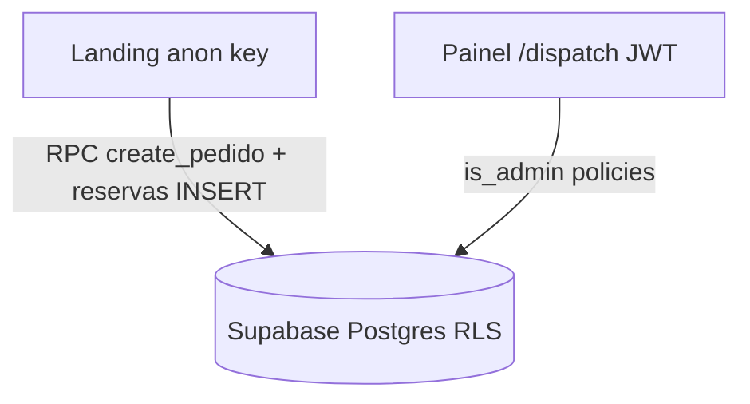

# Segurança — Ferreira na Voz

Checklist de implementação por fases. Marque `- [x]` conforme concluir.

**Arquitetura**



Referências: [`supabase/setup.sql`](../supabase/setup.sql), [`supabase/migrations/security_phase1_rls.sql`](../supabase/migrations/security_phase1_rls.sql), [`.env.example`](../.env.example).

---

## Fase 1 — Crítico (RLS + admin + homepage)

### Código (repositório)

- [x] Migration `security_phase1_rls.sql` (allowlist, `is_admin()`, `claim_token`, RPCs, policies)
- [x] `setup.sql` alinhado com as mesmas regras
- [x] Fluxo homepage: `create_pedido_homepage` + `rollback_pedido_homepage` + `claimToken` no client

### Manual — Supabase Dashboard

- [ ] **Authentication → Providers → Email**: desabilitar registro público (sign-up). Criar usuários admin manualmente ou por convite.
- [ ] **SQL Editor**: executar [`supabase/migrations/security_phase1_rls.sql`](../supabase/migrations/security_phase1_rls.sql) no projeto de produção.
- [ ] **SQL Editor**: executar [`supabase/migrations/security_phase1_fix_reservas_insert.sql`](../supabase/migrations/security_phase1_fix_reservas_insert.sql) (corrige insert em `reservas_semana` após Fase 1).
- [ ] **Admin allowlist**: inserir o e-mail do operador (veja seção abaixo).
- [ ] Confirmar que a conta de login do painel usa exatamente o mesmo e-mail cadastrado na allowlist.

### Inserir e-mail do operador

O e-mail do operador já está no seed da migration (`hoennkeys@gmail.com`). Se o projeto foi migrado **antes** desse seed, execute no SQL Editor:

```sql
insert into public.admin_allowlist (email)
values ('hoennkeys@gmail.com')
on conflict (email) do nothing;
```

### Testes — role anon (homepage)

Execute no SQL Editor com contexto anon ou via API com anon key:

- [ ] `select * from pedidos_cliente` → **deve falhar** (0 rows ou permission denied).
- [ ] Na landing: abrir modal de contratação, preencher e confirmar slot → pedido criado e WhatsApp abre.
- [ ] Simular slot ocupado: após criar pedido, se reserva falhar, pedido não deve permanecer (rollback com `claim_token`).

### Testes — admin autenticado (painel)

Com sessão do operador em `/dispatch`:

- [ ] Listagem de pedidos carrega (Realtime + SELECT admin).
- [ ] Aprovar pedido pendente → status Ativo + fila dispatch.
- [ ] Arquivar / finalizar / remover fechados funciona.
- [ ] Agenda admin: bloquear/desbloquear slot.
- [ ] `repairOrphanReservas` no painel não gera erro de permissão em `pedidos_cliente`.

---

## Fase 2 — Importante

### Headers HTTP (Vercel)

- [ ] Adicionar em `vercel.json`: `Strict-Transport-Security`, `X-Content-Type-Options`, `X-Frame-Options`, `Referrer-Policy`, `Permissions-Policy`.
- [ ] Content-Security-Policy (começar em report-only se necessário; ajustar domínios Twitch/Supabase).

### Aplicação

- [ ] Rate limit ou CAPTCHA (Cloudflare Turnstile) no submit do [`OnboardingModal`](../src/components/landing/OnboardingModal.tsx).
- [ ] Validar `redirect` no login: apenas paths internos (`/dispatch`, etc.) — [`login.tsx`](../src/routes/login.tsx).
- [ ] Proteger [`processTelemetry`](../src/lib/api/telemetry.functions.ts) e [`checkTwitchLive`](../src/lib/api/twitch.functions.ts) (auth admin ou rate limit + cache).
- [ ] MFA na conta admin (Supabase Authentication).

### Dados / secrets

- [ ] Revisar se chave PIX no client pode ir para config server (opcional).
- [ ] Confirmar `.env` fora do git; rotacionar keys se já vazaram.

---

## Fase 3 — Contínuo

- [ ] `npm audit` / Dependabot em dependências críticas.
- [ ] Monitorar picos de `insert` em `pedidos_cliente` (spam).
- [ ] Política de privacidade + base legal LGPD (WhatsApp, Discord, retenção 5 dias).
- [ ] Revisão trimestral de RLS e novas migrations.
- [ ] OWASP ZAP baseline no deploy de produção.
- [ ] Plano de incidente: rotacionar anon/service keys, desabilitar RPC público temporariamente se abuso.

---

## Melhorias futuras (fora das fases acima)

- [ ] RPC transacional único: criar pedido + reservas em uma transação.
- [ ] Tabelas `live_service_session` / `dispatch_queue`: aplicar `is_admin()` nas policies documentadas nos stores.
- [ ] Edge Function com rate limit por IP para `create_pedido_homepage`.

---

## Estado atual da Fase 1

| Recurso | Anon | Admin (`is_admin`) |
|---------|------|---------------------|
| `pedidos_cliente` SELECT | Negado | Permitido |
| `pedidos_cliente` INSERT direto | Negado | — |
| `pedidos_cliente` via RPC homepage | `create_pedido_homepage` | — |
| `pedidos_cliente` rollback homepage | `rollback_pedido_homepage` + token | — |
| `reservas_semana` SELECT | Permitido (grade) | Permitido |
| `reservas_semana` INSERT | Só pedido Pendente homepage | — |
| `reservas_semana` DELETE | Negado (RPC rollback) | Permitido |
| `disponibilidade_agenda` UPDATE admin | Negado | `is_admin()` |
